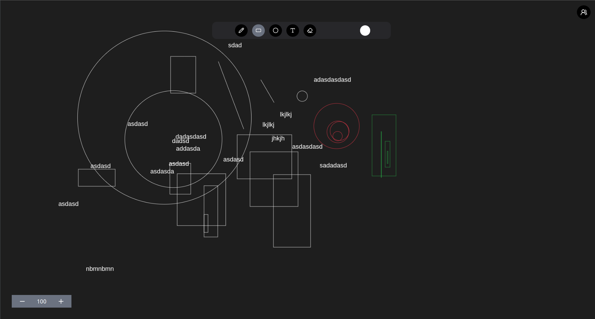

# 🎨 DrawApp – Real-time Collaborative Drawing App  

**DrawApp** is a **real-time collaborative whiteboard application** where users can draw shapes, add text, change colors, and scale the canvas—all in real time. Built with **Next.js**, **Socket.IO**, **TailwindCSS**, and **Aceternity UI**, the app ensures smooth collaboration, robust authentication with **NextAuth**, and high scalability using **Redis**.  

---

## Demo Video
[](https://drive.google.com/file/d/1MNp7cL94q9ZZtsnVhW3ZCtboxnDxOa-k/view?usp=sharing)

## 🚀 Features  

- ✅ **Real-time Collaboration** with Socket.IO  
- ✅ **Shapes Supported** – Rectangle, Circle, Line, and Text  
- ✅ **Dynamic Colors** – Change shape colors instantly  
- ✅ **Canvas Scaling** – Zoom in or out easily  
- ✅ **Authentication** – Secure login via NextAuth  
- ✅ **Modern UI** – TailwindCSS + Aceternity UI  
- ✅ **Redis Pub/Sub** – Scale Socket.IO across multiple instances  
- ✅ **Job Queues with Redis** –  
  - Flush shapes from Redis to PostgreSQL  
  - Handle email verification & password reset requests at scale  

---

## 🛠 Tech Stack  

- **Frontend**: [Next.js](https://nextjs.org/), [TailwindCSS](https://tailwindcss.com/), [Aceternity UI](https://ui.aceternity.com/)  
- **Backend**: Next.js API Routes + [Socket.IO](https://socket.io/)  
- **Authentication**: [NextAuth.js](https://next-auth.js.org/)  
- **Real-time Communication**: Socket.IO + Redis Pub/Sub  
- **Job Queues**: Redis Queues for background tasks
- **Database**: PostgreSQL   

---
## ⚡ Installation & Setup using `Docker`
```bash
# Clone the repository
git clone https://github.com/RahulGIT24/draw-app
cd draw-app
# Build and run the Docker containers
docker-compose up
```